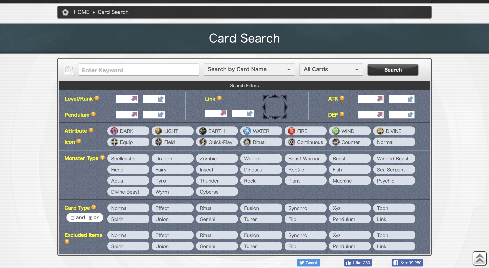
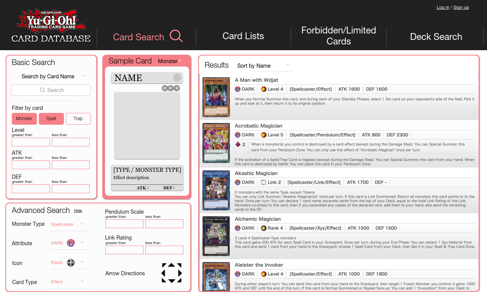
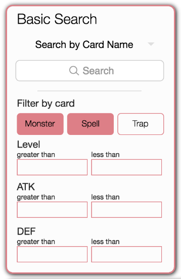
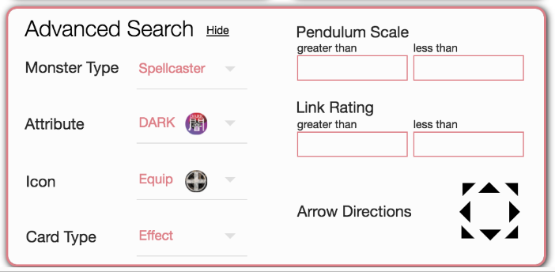
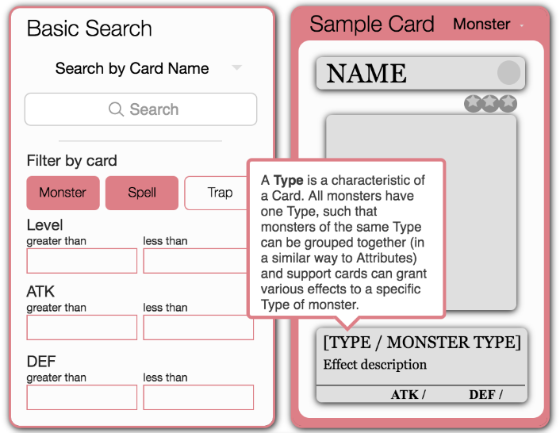
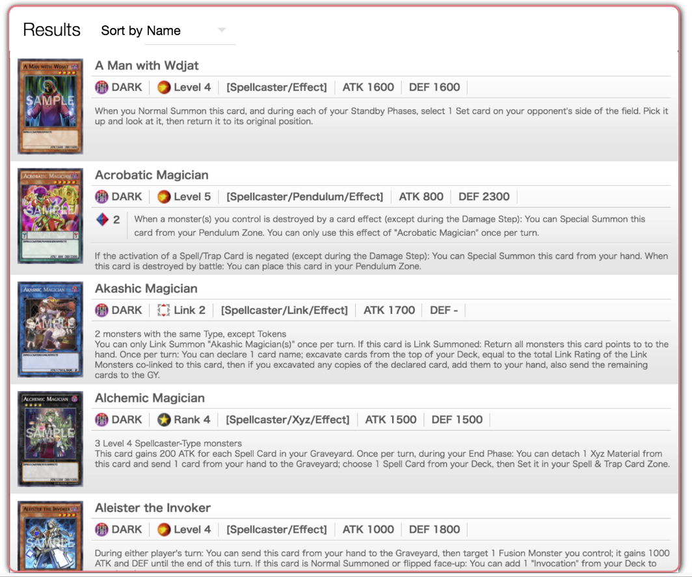

# Rethinking the _Yu-Gi-Oh!_ Card Database Search Page

## Part 1 – The Problem

Imagine that you’re 6 years old. You’ve watched a few episodes of this show called _Yu-Gi-Oh!_ It features people “dueling” each other with huge monsters and scary demons, all of which are controlled by a card game.

Only – the rules are really complicated. You don’t immediately understand the paragraphs on paragraphs of text that accompany each card, detailing minute effects or duel restrictions that only get more and more complicated as the series progresses.

You want to learn more, but you’re intimated by the complexity.

You go online to look up some cards. Maybe you search “yugioh cards” and click the second link – the official _Yu-Gi-Oh!_ card database. You’re hit with this:

Wow. That looks pretty scary.

Immediately you’re hit with a ton of visual information. The cognitive load is high. Though it would only take a short while for you to comprehend maybe what is going on, it is unlikely that you would even stay on the page long enough for that to happen. You might be scared off.

**Problem – How can the _Yu-Gi-Oh!_ card database search page be more welcoming for beginners?**

In order to approach this question, we need to identify what exactly makes this form so intimidating.

**Cluttered Design**. The interface is crammed with way too many things. There are a total of 69 buttons, 11 input boxes, and 2 dropdown menus on the page. With its extreme precision and insistence on including every mechanic in the game all together on the same screen, the page is likely designed for experienced players with a specific idea of what cards they are looking for. This makes the page intimidating for beginners.

**Lack of Help and Documentation**. Help is hard to find. If a beginner user were to stick around and investigate the page, they would be hard-pressed to find explanations for any of the elements on the page. For example, hovering over the orange “?” circle next to the “Pendulum” title presents the message “Search by Pendulum Scale.” No further explanation of what the heck a “Pendulum Scale” actually _is_.

With these two problems in mind, I set out to design an interface that would:
1.	**Be simple and clean** to minimize cognitive load on beginners.
2.	**Have easy access to help and documentation** to make the game less intimidating.
3.	**Maintain precise functionality** to cater to experienced users.

## Part 2 – The Redesign

After several design iterations, I was able to condense the clutter of the previous search page and come up with a clean, informative, and reactive search page, albeit with a relative loss of precision. Let’s take an in-depth look at each section of the page.

**Basic Search**. One of the first things I did was split search options into two categories: Basic and Advanced. This way, beginners who only understand the basics of the card game are not intimidated by the plethora of search options before them. As such, the “Basic Search” section groups the most elementary search options together, containing the search bar as well as some coarse filters (i.e. “Monster”, “Spell”, and “Trap” cards).

**Advanced Search**. For experienced players, the “Advanced Search” form allows for much more precision in searches than the Basic Search form. The dozens of buttons that cluttered the previous interface have been replaced with dropdown menus for each category, effectively tidying up the interface. However, with this simpler interface yields a loss of precision – only one Attribute, Icon, Monster Type, or Card Type can be selected at a time. This is a calculated tradeoff when considering the improved usability, learnability, and efficiency gained.

**Sample Card**. Perhaps the most significant change from the original search page, the “Sample Card” allows a user to understand the context behind each search category. When hovering the cursor above any part of the sample card, an informative box appears providing an in-depth explanation of that part (definitions taken from http://yugioh.wikia.com). At the same time, because they are roped off in their own section, these helpful hints are unobtrusive and easily ignored by those who understand the game or who just want to find a specific card. Card templates can be toggled between “Monster”, “Pendulum Monster”, “Link Monster”, “Spell”, and “Trap” cards.

**Results**. Though the individual results themselves remain virtually unchanged (as I found that they organized information in a pragmatic and easy to comprehend way), the most significant change from the previous interface is the reactivity of this section. Using React, cards can be filtered and sorted in real-time, without having to submit a complicated form and be redirected to a brand new page. This makes searching a breeze – errors in the complex search form can be quickly corrected (without having to backtrack to a previous page) and results can be easily tracked.

**Summary**. 

The previous cluttered, intimidating search page has been replaced with a cleaner interface that caters especially to new users. 

Search options are divided to reduce cognitive load on the user, and help and documentation are easy to access. Some precision in searches is lost, but that is made up for by the improved learnability of the interface. 

The reactivity of the results allows users to visualize relationships between search categories in real-time, giving curious players free reign to quickly and iteratively explore whatever combination of search options they desire.
